# Purpur Packs
These are features that fit the "Purpur" theme, or have been requested for Purpur, but work better as a datapack.

What determines if something should be a datapack is if the feature is data-driven. You can kinda look through repos like [misode's mcmeta](https://github.com/misode/mcmeta/tree/summary) or use a tool to decompile minecraft yourself to see what is data-driven. 
There's a folder in the first directory, named `data` - everything in that directory is modifiable by datapacks.

## Smithing Recipes
[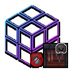](https://modrinth.com/datapack/purpurpacks-no-template-netherite-armor-upgrades)
[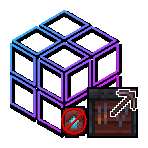](https://modrinth.com/datapack/purpurpacks-no-template-netherite-tool-upgrades/versions)
[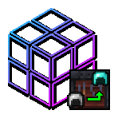](https://modrinth.com/datapack/purpurpacks-iron-to-diamond-armor-upgrades/versions)

[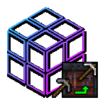](https://modrinth.com/datapack/purpurpacks-stone-to-iron-tools-upgrades/versions)
[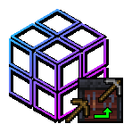](https://modrinth.com/datapack/purpurpacks-wooden-to-stone-tools-upgrades/versions)

## Crafting Recipes
[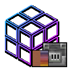](https://modrinth.com/datapack/purpurpacks-re-dye-terracotta/versions)
[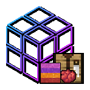](https://modrinth.com/datapack/purpurpacks-re-dye-concrete-powder/versions)
[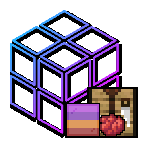](https://modrinth.com/datapack/purpurpacks-re-dye-glass/versions)
[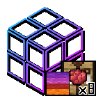](https://modrinth.com/datapack/purpurpacks-more-dyed-wool-and-carpet/versions)
[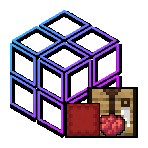](https://modrinth.com/datapack/purpurpacks-one-step-dyed-shulker-boxes/versions)
[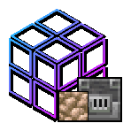](https://modrinth.com/datapack/purpurpack-smelt-raw-ore-blocks)
[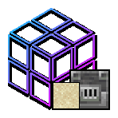](https://modrinth.com/datapack/purpurpack-blasting-smelts-glass)
## Loot Tables
[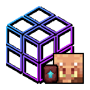](https://modrinth.com/datapack/purpurpacks-one-step-dyed-shulker-boxes/versions)

[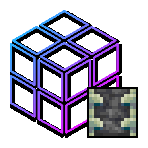](https://modrinth.com/datapack/purpurpacks-silk-touch-reinforced-deepslate/versions)

## Effective tools
[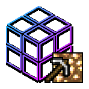](https://modrinth.com/datapack/purpurpacks-pickaxe-effective-light-source-blocks/versions)
[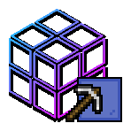](https://modrinth.com/datapack/purpurpacks-pickaxe-effective-glass/versions)
[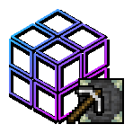](https://modrinth.com/datapack/purpurpacks-pickaxe-effective-reinforced-deepslate/versions)
[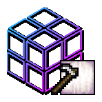](https://modrinth.com/datapack/purpurpacks-hoe-effective-froglights/versions)

[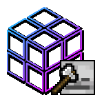](https://modrinth.com/datapack/purpurpacks-axe-effective-skulls/versions)

## Mob behavior
[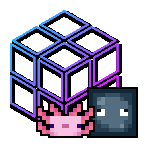](https://modrinth.com/datapack/purpurpack-axolotls-ignore-passives/versions)
[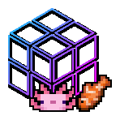](https://modrinth.com/datapack/purpurpack-breed-axolotl-with-tropical-fish-item)

## World Behavior
[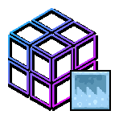](https://modrinth.com/datapack/purpurpacks-placeable-new-paintings/versions)

[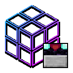](https://modrinth.com/datapack/purpurpacks-transparent-blocks-in-enchant-area/versions)

## Beacon Base Materials
[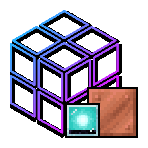](https://modrinth.com/datapack/purpurpacks-copper-block-beacon-base/versions)
[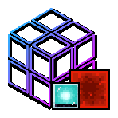](https://modrinth.com/datapack/purpurpacks-redstone-beacon-base/versions)
[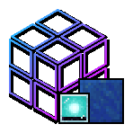](https://modrinth.com/datapack/purpurpacks-lapis-beacon-base/versions)
[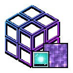](https://modrinth.com/datapack/purpurpacks-amethyst-beacon-base/versions)
[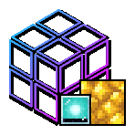](https://modrinth.com/datapack/purpurpacks-raw-gold-beacon-base/versions)
[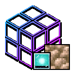](https://modrinth.com/datapack/purpurpacks-raw-iron-block-beacon-base/versions)
[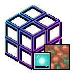](https://modrinth.com/datapack/purpurpacks-raw-copper-beacon-base/versions)
